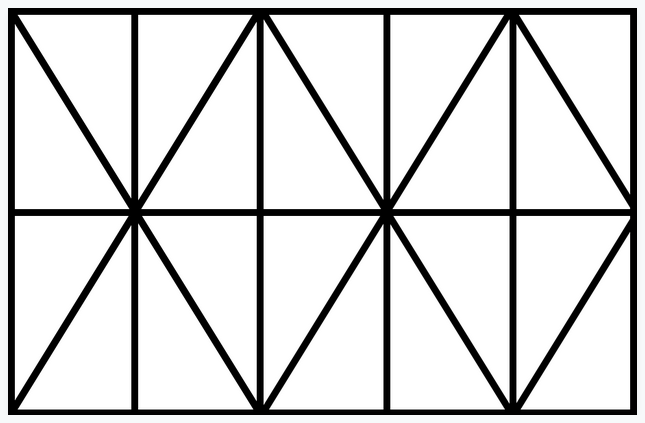

#Rug triangles
This is a script  to obtain all of the possible triangles in a pattern like this

This was inspired by [stanupmath](https://www.youtube.com/channel/UCSju5G2aFaWMqn-_0YBtq5A)'s video "[The Rug Puzzle: how many triangles?](https://www.youtube.com/watch?v=HViA6N3VeHw&t=36s)"
####Usage
Simply use python3 to run the script. As for arguments:
1. nª of triangles that form the base
2. nª of triangles that form the side
3. parity of the diagonals (true if a diagonal comes out of the bottom left vertex, false otherwise)
4. path to output the result
